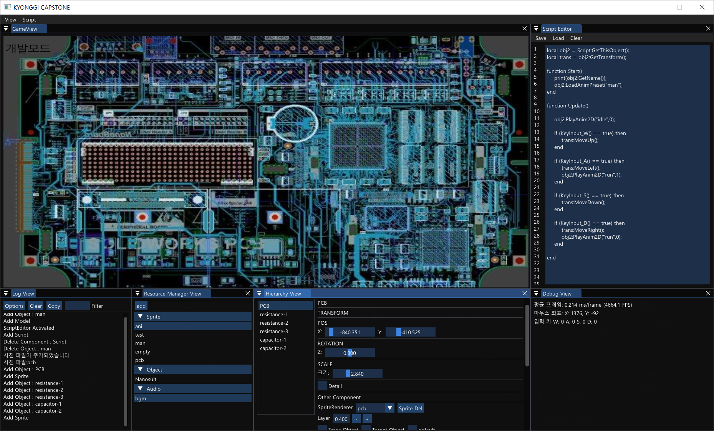
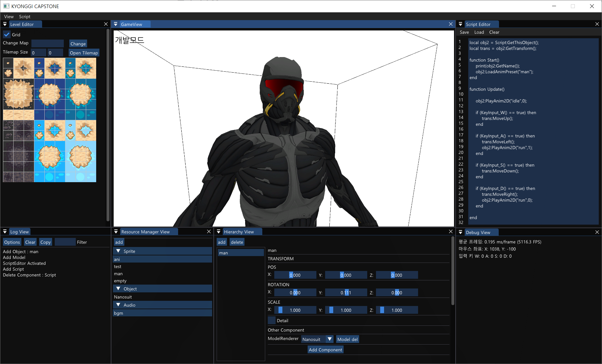

# KGCRenderFramework

### 개발에 대한 진입장벽을 낮추기 위한 로우 코드 기반 프레임워크

-------------------------------------

2023.03.02 ~ 2023.06.14 

2023 AI컴퓨터공학 산학협력 프로젝트 캡스톤 디자인 경진대회 - 졸업시켜조 (경진대회 금상 수상)

구동혁(팀장) / 김민태 / 박종민 / 여운용 / 이윤호 / 이정우

## 📌 프로젝트 개요

현재 교육과정 속 코딩과 실무 속의 코딩의 차이는 크다. 이는 프로그래밍을 접한 지 얼마 되지 않은 초심자들에게는 실무에서 개발하는 수준의 프로그래밍을 요구하기 어려울 수 있다는 것을 의미한다.

이 프레임워크에서는 **Lua Script**를 도입한 로우 코드 개발 툴을 제안하여 스마트 팩토리 또는 게임 분야에서 코딩 입문 단계의 사용자들에게 쉬우면서도 실제 개발 환경에 빠르게 제공할 수 있는 환경을 제공한다.

이 프로젝트에서는 Lua Script 함수와 C++ 코드 내의 함수를 매핑하여, 마치 **Unity MonoBehaviour**의 **Start()**나 **Update()** 함수 같은 기능을 스크립트 내에서 제공합니다. 이는 런타임에서 핫스왑을 통해 동적 디버깅이 가능하도록 설계하였습니다. 
또한, 스크립트에서 호출하는 함수를 로우 코드화하여 코드의 복잡성을 줄이고, IoC(제어의 역전) 원칙을 적용해 보다 관점 지향적인 개발 환경을 제공하도록 설계하였습니다.

## 📽️ 프로젝트 시연 영상

[2023년도 캡스톤 디자인 졸업시켜조](https://youtu.be/IOTC4dQy9ts?si=V_iuRMskvEUy49-L)

## 🧩 담당 역할

* 구동혁(팀장): 프로젝트 환경 구축, 컴포넌트 기반 게임엔진 프레임워크 핵심 로직을 담당했고, 게임 오브젝트 관련 Lua Script & C++ 내부 함수 간의 매핑을 작업하였습니다. DirectX11 환경에서 Assimp 와 Fmod 그리고 imgui을 연동하는 작업을 담당하였습니다. 추가적으로는 논문 초안 작성, 프로젝트의 소스코드 관련 브랜치들의 형상관리 등을 관리 하였습니다. 

* 김민태: 전반적으로 백엔드의 기초적인 로직 구현, 프론트에 인터페이스 제공등의 연결, 오디오 기능들의 간단한 루아 스크립트 기능 매핑, 카메라 시점 변환등의 내부 로직 위주의 개발을 담당했으며 외부적으로는 유즈케이스, 시나리오등의 단순한 초기 요구사항 분석, 해당 프로젝트에 대한 수요도 설문조사등의 조사를 진행했습니다.

* 박종민: 백엔드에서는 오디오 매니저, 게임 오브젝트 매니저를 개발을 담당했고, 전반적인 백엔드의 수정 및 디버깅을 했습니다. 프론트엔드에서는 리소스 매니저 뷰 개선, 스크립트 에디터 개발, 창 ON/OFF 개발 등을 담당했습니다. 마지막으로 유튜브 동영상 제작 및 편집, 발표 보조 영상 자료 보조 제작 및 편집, 문서 관리 등을 했습니다.

* 여운용: 프론트엔드에서의 디버그 뷰, 로그 뷰, 리소스 매니저 뷰의 개발을 담당해 프로그램 실행간 어떠한 기록·버그들이 있었는지 확인할 수 있고, 리소스 매니저뷰에서의 파일추가 기능을 통해 사용자가 원하는 캐릭터, 사진, 맵, 오디오파일 등을 추가 및 선택할 수 있게 했습니다. 추가적으로 프로젝트 진행 간 필요했던 논문·프로젝트 발표용 PPT 전담, 주간업무 실적, 최종보고서, 팜플렛, 포스터, 최종영상 시나리오 구성 등을 담당했으며, 팀원들 간 일정조율 및 프로젝트 스케줄 관리를 했습니다.

* 이윤호: 프론트엔드에서 레벨에디터 창을 담당해 맵 선택 기능 구현, 사용자가 선택한 이미지 구역별 출력 기능 구현, 동적 배열로 사용자가 새롭게 만든 맵 저장 및 스프라이트 등록 기능 구현, 경고 메시지와 알림 출력 기능 구현, 덧붙여 논문에서는 참고 문헌 조사, 논문 내용 작성 보조 및 정리, 논문 참고용 시각 자료 첨부 등을 했습니다.

* 이정우: 프론트엔드에서 계층뷰를 담당해 오브젝트의 추가·삭제, 컴포넌트의 추가·삭제 오브젝트, 컴포넌트의 종류에 따른 좌표 이동, 스프라이트 간 우선순위 추가, 오브젝트 간 충돌 및 상호작용 표현, 각종 팝업(경고 메시지) 추가, 논문 내용 작성 및 정리 등을 했습니다.

## 🛠️ 기술 스택

* DirectX11 

  https://walbourn.github.io/where-is-the-directx-sdk-2021-edition/

* DirectXTK(DirectX Tool Kit for DirectX 11)	

  https://github.com/microsoft/DirectXTK

* DirectXTex

  https://github.com/microsoft/DirectXTex

* assimp	

  https://github.com/assimp/assimp

* imgui

  https://github.com/ocornut/imgui

* FMOD

  https://www.fmod.com/

* Lua Script

  http://www.lua.org/

