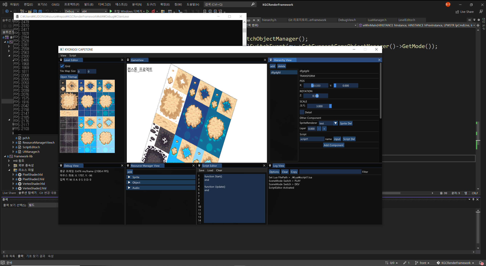

# KGCRenderFramework

### 개발에 대한 진입장벽을 낮추기 위한 로우 코드 기반 게임엔진 프레임워크

-------------------------------------

현재 교육과정 속 코딩과 실무 속의 코딩의 차이는 크다. 이는 프로그래밍을 접한 지 얼마 되지 않은 초심자들에게는 실무에서 개발하는 수준의 프로그래밍을 요구하기 어려울 수 있다는 것을 의미한다.

 이 프레임워크에서는 게임업계에서 많이 사용하는 **Lua Script**를 도입한 로우 코드 개발 툴을 제안하여 코딩 입문 단계의 사용자들에게 쉬우면서도 실제 개발 환경에 빠르게 제공할 수 있는 환경을 제공한다.

### Tech Stack

* DirectX11 

  https://walbourn.github.io/where-is-the-directx-sdk-2021-edition/

* DirectXTK(DirectX Tool Kit for DirectX 11)	

  https://github.com/microsoft/DirectXTK

* DirectXTex

  https://github.com/microsoft/DirectXTex

* assimp	

  https://github.com/assimp/assimp

* imgui

  https://github.com/ocornut/imgui

* FMOD

  https://www.fmod.com/

* Lua Script

  http://www.lua.org/

  

